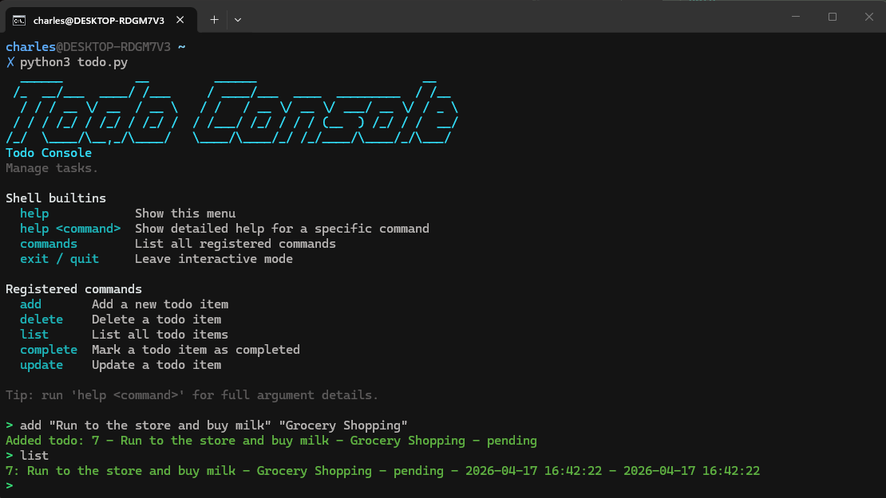
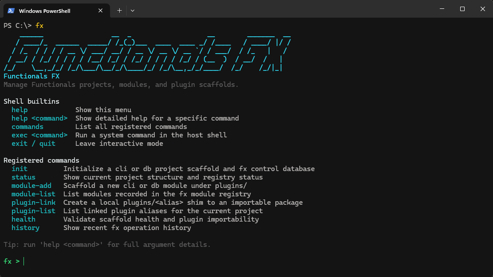
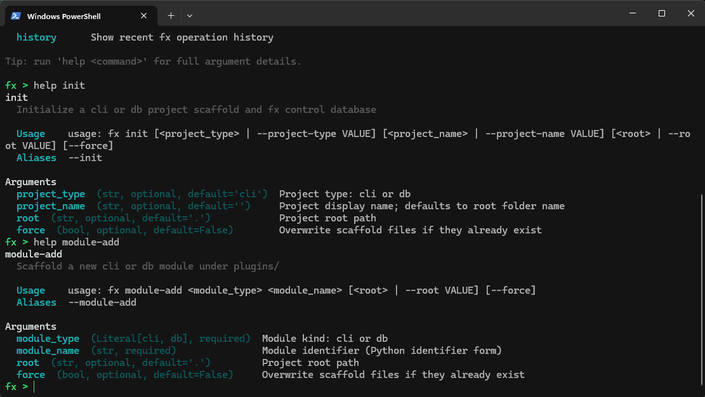

# Functionals

[](https://pypi.org/project/decorates/)
[](https://pypi.org/project/decorates/)
[](LICENSE)
[](#decorates)
[](#decoratescli)
[](#decoratesdb)
[](#testing)

Decorates is a production-oriented toolkit for two common Python surfaces:

- `functionals.cli` for module-first command registration, typed arguments, and built-in help
- `functionals.db` for Pydantic model persistence and additive schema operations on SQLAlchemy

The package emphasizes explicit APIs, predictable behavior, and test-backed reliability.

## Install

```bash
pip install decorates  # Package name is `decorates`; module name is `functionals`
```

## Quick Start Guide

1. Build one CLI command with a decorator.
2. Build one DB model with a decorator.
3. Use `Model.objects` for CRUD.

### CLI in minutes

```python
from __future__ import annotations

from enum import StrEnum
from time import strftime

import functionals.cli as cli
import functionals.db as db
from functionals.db import db_field
from pydantic import BaseModel

DB_PATH = "todos.db"
TABLE = "todos"
NOW = lambda: strftime("%Y-%m-%d %H:%M:%S")


class TodoStatus(StrEnum):
    PENDING = "pending"
    COMPLETED = "completed"


@db.database_registry(DB_PATH, table_name=TABLE, key_field="id")
class TodoItem(BaseModel):
    id: int | None = None
    title: str = db_field(index=True)
    description: str = db_field(default="")
    status: TodoStatus = db_field(default=TodoStatus.PENDING.value)
    created_at: str = db_field(default_factory=NOW)
    updated_at: str = db_field(default_factory=NOW)


@cli.register(name="add", description="Create a todo item")
@cli.argument("title", type=str, help="Todo title")
@cli.argument("description", type=str, default="", help="Todo description")
@cli.option("--add")
@cli.option("-a")
def add_todo(title: str, description: str = "") -> str:
    todo = TodoItem(title=title, description=description)
    todo.save()
    return f"Added: {todo.title} (ID: {todo.id})"


@cli.register(name="list", description="List todo items")
@cli.option("--list")
@cli.option("-l")
def list_todos() -> str:
    todos = TodoItem.objects.all()
    if not todos:
        return "No todo items found."
    return "\n".join(f"{t.id}: {t.title} [{t.status}]" for t in todos)


@cli.register(name="complete", description="Mark a todo item as completed")
@cli.argument("todo_id", type=int, help="Todo ID")
@cli.option("--complete")
@cli.option("-c")
def complete_todo(todo_id: int) -> str:
    todo = TodoItem.objects.get(id=todo_id)
    if not todo:
        return f"Todo item with ID {todo_id} not found."

    todo.status = TodoStatus.COMPLETED.value
    todo.updated_at = NOW()
    todo.save()
    return f"Completed todo ID {todo_id}."


@cli.register(name="update", description="Update a todo item")
@cli.argument("todo_id", type=int, help="Todo ID")
@cli.argument("title", type=str, default=None, help="New title")
@cli.argument("description", type=str, default=None, help="New description")
@cli.option("--update")
@cli.option("-u")
def update_todo(todo_id: int, title: str | None = None, description: str | None = None) -> str:
    todo = TodoItem.objects.get(id=todo_id)
    if not todo:
        return f"Todo item with ID {todo_id} not found."

    todo.title = title or ""
    todo.description = description or ""
    todo.updated_at = NOW()
    todo.save()
    return f"Updated todo ID {todo_id}."


if __name__ == "__main__":
    cli.run(
        shell_title="Todo Console",
        shell_description="Manage tasks.",
        shell_colors=None,
        shell_banner=True,
        shell_usage=True,  # Prints usage menu on startup
    )
```

Run it as follows:

```bash
# Add
python todo.py add "Buy groceries" "Milk, eggs, bread"
python todo.py --add "Buy groceries" "Milk, eggs, bread"
python todo.py -a "Buy groceries" "Milk, eggs, bread"
python todo.py add --title "Buy groceries" --description "Milk, eggs, bread"

# List
python todo.py list
python todo.py --list
python todo.py -l

# Complete
python todo.py complete 1
python todo.py --complete 1
python todo.py -c 1

# Update
python todo.py update 1 "Read two books" "Finish both novels this week"
python todo.py update 1 --title "Read two books" --description "Finish both novels this week"
python todo.py --update 1 --title "Read two books"
```

Or:

```bash
# Run directly for interactive mode
python todo.py
```
Interactive mode:



### `functionals.fx` in minutes (project-type init + health)

`functionals.fx` is the project tooling layer built on top of the CLI + DB modules.
After local install (`pip install -e .`), you can run:

```bash
fx --help
```

Create a CLI-first project structure:

```bash
mkdir todo_cli && cd todo_cli
fx init cli TodoService .
fx health .
```

Expected structure:

```text
app.py
plugins/__init__.py
.functionals/fx.db
```

Create a DB-first project structure:

```bash
mkdir ../todo_db && cd ../todo_db
fx init db DataService .
fx health .
```

Expected structure:

```text
models.py
plugins/__init__.py
.functionals/fx.db
```




Notes:
- `fx init <project_name>` still works and defaults to `cli`.
- `fx health` is the canonical check command (`--doctor` is kept as a compatibility alias).

### Database + FastAPI in 5 minutes

```python
from contextlib import asynccontextmanager
from fastapi import FastAPI, HTTPException
from pydantic import BaseModel
from functionals.db import (
    RecordNotFoundError,
    UniqueConstraintError,
    database_registry,
)

DB_URL = "sqlite:///shop.db"

# --- Models ---

@database_registry(DB_URL, table_name="customers", unique_fields=["email"])
class Customer(BaseModel):
    id: int | None = None
    name: str
    email: str

@database_registry(DB_URL, table_name="products")
class Product(BaseModel):
    id: int | None = None
    name: str
    price: float

@database_registry(DB_URL, table_name="orders")
class Order(BaseModel):
    id: int | None = None
    customer_id: int
    product_id: int
    quantity: int
    total: float

# --- App ---

@asynccontextmanager
async def lifespan(app: FastAPI):
    for model in (Customer, Product, Order):
        model.create_schema()
    yield
    for model in (Customer, Product, Order):
        model.objects.dispose()

app = FastAPI(lifespan=lifespan)

# --- Routes ---

@app.post("/customers", response_model=Customer, status_code=201)
def create_customer(name: str, email: str):
    return Customer.objects.create(name=name, email=email)

@app.get("/customers/{customer_id}", response_model=Customer)
def get_customer(customer_id: int):
    return Customer.objects.require(customer_id)

@app.post("/products", response_model=Product, status_code=201)
def create_product(name: str, price: float):
    return Product.objects.create(name=name, price=price)

@app.post("/orders", response_model=Order, status_code=201)
def create_order(customer_id: int, product_id: int, quantity: int):
    product = Product.objects.require(product_id)
    return Order.objects.create(
        customer_id=customer_id,
        product_id=product_id,
        quantity=quantity,
        total=product.price * quantity,
    )

@app.get("/orders/desc", response_model=list[Order])
def list_orders_desc(limit: int = 20, offset: int = 0):  # Filter by oldest   (1, 2, 3,..., n)
    return Order.objects.filter(order_by="id", limit=limit, offset=offset)

@app.get("/orders/asc", response_model=list[Order])
def list_orders_asc(limit: int = 20, offset: int = 0):  # Filter by newest  (n,..., 3, 2, 1)
    return Order.objects.filter(order_by="-id", limit=limit, offset=offset)
```

```bash
# POST /customers
curl -X POST "http://localhost:8000/customers" \
  -H "Content-Type: application/json" \
  -d '{"name": "Alice Johnson", "email": "alice@example.com"}'

# Response
{"id": 1, "name": "Alice Johnson", "email": "alice@example.com"}


# GET /customers/1
curl "http://localhost:8000/customers/1"

# Response
{"id": 1, "name": "Alice Johnson", "email": "alice@example.com"}


# POST /products
curl -X POST "http://localhost:8000/products" \
  -H "Content-Type: application/json" \
  -d '{"name": "Wireless Keyboard", "price": 49.99}'

# Response
{"id": 1, "name": "Wireless Keyboard", "price": 49.99}


# POST /orders
curl -X POST "http://localhost:8000/orders" \
  -H "Content-Type: application/json" \
  -d '{"customer_id": 1, "product_id": 1, "quantity": 2}'

# Response
{"id": 1, "customer_id": 1, "product_id": 1, "quantity": 2, "total": 99.98}


# GET /orders/asc  (oldest first)
curl "http://localhost:8000/orders/asc?limit=20&offset=0"

# Response
[
  {"id": 1, "customer_id": 1, "product_id": 1, "quantity": 2, "total": 99.98}
]


# GET /orders/desc  (newest first)
curl "http://localhost:8000/orders/desc?limit=20&offset=0"

# Response
[
  {"id": 1, "customer_id": 1, "product_id": 1, "quantity": 2, "total": 99.98}
]
```

## Core Concepts

### `functionals.cli`

- Register functions with module-level decorators: `@register`, `@argument`, `@option`.
- Run command handlers through the module registry via `functionals.cli.run()`.
  With no argv in an interactive terminal, `run()` enters REPL mode.
- Support positional + named argument forms (for non-bool args), with bool flags as `--flag`.
- Command aliases are declared with `@option("-x")` / `@option("--long")`.
- Built-in help command is always available: `help`, `--help`, and `-h`.
- `help <command>` prints command purpose, invocation tokens, usage, and
  argument-level invocation forms.
- Interactive mode can be entered explicitly with `--interactive` / `-i` or
  programmatically via `functionals.cli.run_shell()`.
- Interactive shell banners use `pyfiglet` automatically when installed,
  with a clean built-in ASCII fallback when it is not.
- Interactive shell output supports terminal colors (auto-detected) and uses
  a dedicated in-shell help menu via `help`.
- Interactive shell branding is configurable (`shell_title`,
  `shell_description`) for custom app consoles.
- `functionals.cli.run(...)` accepts shell options too, so one entrypoint can
  serve both normal CLI args and interactive mode.
  Options include `shell_prompt`, `shell_title`, `shell_description`,
  `shell_banner`, `shell_colors`, `shell_input_fn`, and `shell_usage`.
- Runtime wraps unexpected handler crashes as `CommandExecutionError` (with original exception chaining).
- Operational logs use standard Python logging namespaces under `functionals.cli.*`.

### `functionals.db`

- Register `BaseModel` classes with `@database_registry(...)`.
- Access all persistence through `Model.objects`.
- `id: int | None = None` gives database-managed autoincrement IDs.
- Schema helpers are available as class methods: `create_schema`, `drop_schema`, `schema_exists`, `truncate`.
- Unexpected SQLAlchemy runtime failures are normalized into `SchemaError` for cleaner, predictable error handling.
- Operational logs use standard Python logging namespaces under `functionals.db.*`.
- DB exceptions provide structured metadata (`exc.context`, `exc.to_dict()`) for production diagnostics.

## `functionals.db` Usage Snapshot

```python
# Filtering operators
Order.objects.filter(total__gte=100)
Customer.objects.filter(email__ilike="%@example.com")
Order.objects.filter(quantity__in=[1, 2, 3])

# Sorting and pagination
Order.objects.filter(order_by="-id", limit=20, offset=0)

# Bulk writes
Product.objects.bulk_create([...])
Product.objects.bulk_upsert([...])

# Additive migration helpers
Customer.objects.ensure_column("phone", str | None, nullable=True)
Customer.objects.rename_table("customers_archive")
```

After `rename_table(...)` succeeds, the same `Model.objects` manager and
schema helpers are immediately bound to the new table name.

If your model contains a field named `password`, password values are automatically hashed on write, and instances receive `verify_password(...)`.

## Documentation

- DB guide: `src/functionals/db/USAGE.md`
- FX guide: `src/functionals/fx/USAGE.md`
- CLI source API: `src/functionals/cli`
- DB source API: `src/functionals/db`

## Requirements

- Python 3.10+
- `pydantic>=2.0`
- `sqlalchemy>=2.0`

## Testing

- The default `pytest` suite includes SQLite coverage along with PostgreSQL/MySQL integration tests for rename-state behavior.
- Run Docker Desktop, or another compatible Docker engine, before executing the backend integration suite so the services in `docker-compose.test-db.yml` can boot successfully.
- The package is backed by a rigorous, production-focused test suite (170+ tests) covering unit behavior, edge cases, and multi-dialect integration scenarios.


## License

MIT
